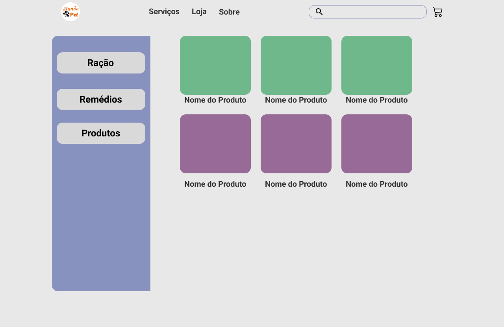
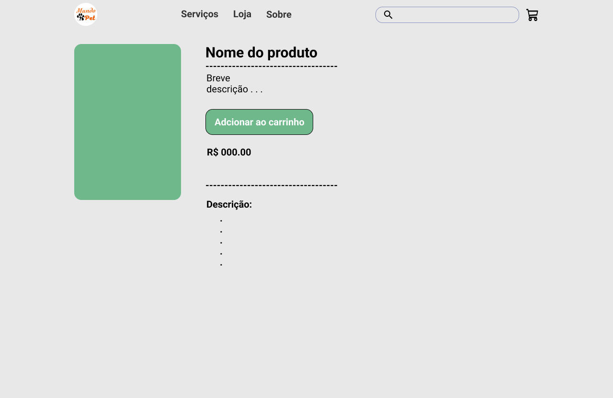
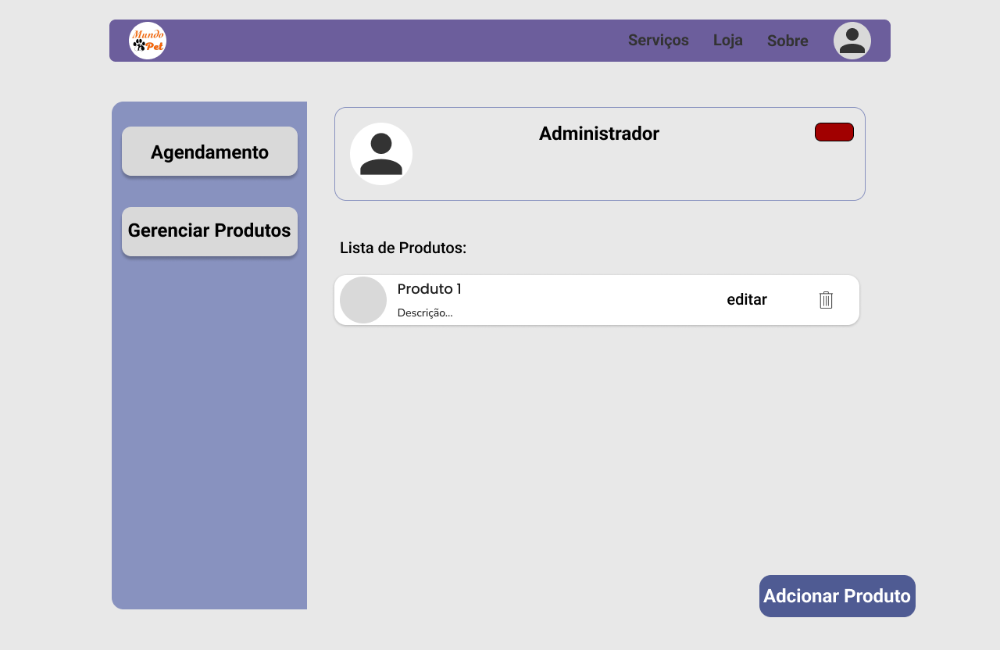
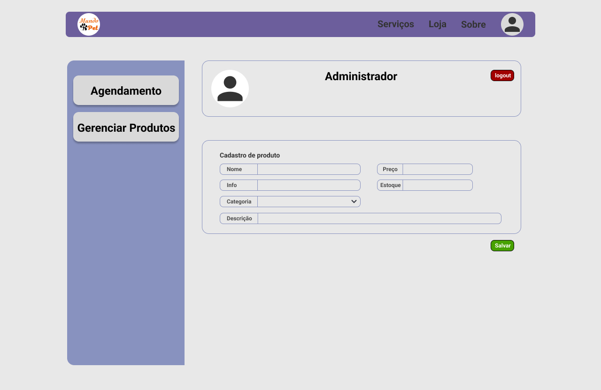
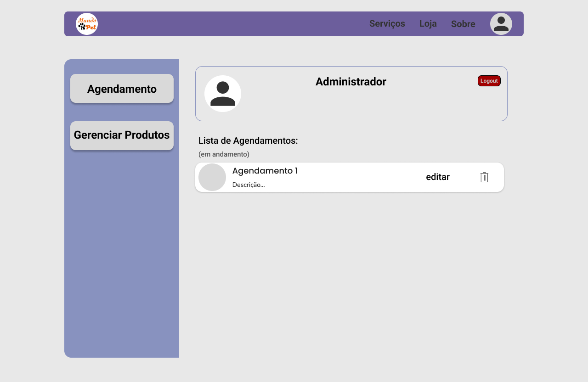
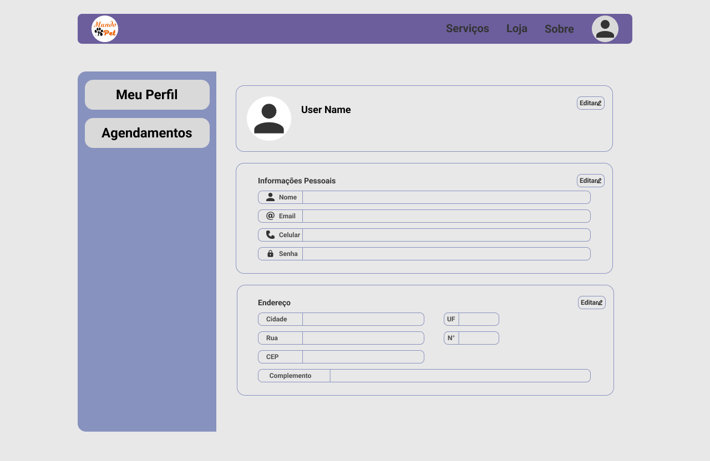
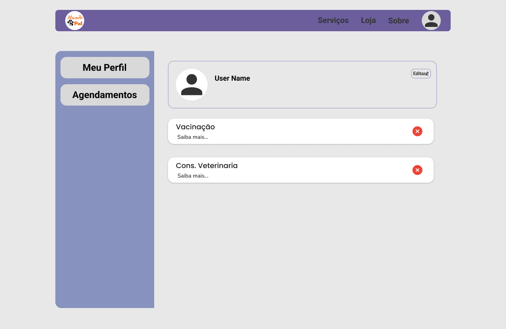

# Engenharia de Software 2024.2 - Universidade Federal do Tocantins
 Bacharelado em Ciência da Computação, 4º semestre
 Professor: Edeilson Milhomem da Silva
 Grupo: Lauro, Vicente, Henrique, José Borges, André Victor

## Mundo Pet
### Descrição 
Protótipo de Tela:

O Mundo Pet consiste em uma plataforma online para petshops, com funcionalidades de registro e acesso para clientes e administradores. O sistema oferece um catálogo abrangente de produtos e serviços, permitindo que os clientes agendem serviços e adicionem itens ao carrinho de compras. A plataforma também integra um sistema de pagamento online, garantindo uma experiência de compra prática e segura.

---

### Requisitos Funcionais do Projeto

RF01 - Cadastro do Usuário

RF02 - Login do Usuário e Administrador

RF03 - Catálogo de Serviços

RF04 - Agendamento de Serviços

RF05 - Carrinho de Compras

RF06 - Pagamento Online

RF07 - Catálogo de Produtos

RF08 - Gerenciamento de Produtos

RF09 - Gerenciamento de Agendamentos

RF10 - Gerenciamento dos Dados do Usuário pelo usuário 

RF11 - Gerenciamento dos agendamentos pelo usuário

RF12 - Notificações de Agendamentos e Compras

RF13 - Sistema de Feedback dos Serviços
---

### User Stories

**RF01 - Cadastro do Usuário** 
1. Como um cliente, quero poder criar uma conta no sistema para acessar os produtos e serviços oferecidos pelo petshop, registrando minhas informações pessoais, como nome, e-mail, telefone e endereço, para agilizar futuras compras e agendamentos. Para isso, na tela de login devo clicar em "Cadastre-se" logo abaixo do botão "Login". Ao clicar irá abrir o formulário de cadastro, no qual devo preencher todos os dados para concluir o cadastro.
 
Protótipo de Tela:
 

**RF02 - Login do Usuário e Administrador**
1. Como um cliente cadastrado, quero poder acessar a plataforma utilizando meu e-mail e senha, para gerenciar minha conta e utilizar os serviços do petshop. Para isso, devo preencher os campos e-mail e senha com os dados cadastrados.

2. Como um cliente cadastrado, desejo recuperar minha senha caso a esqueça, para garantir que possa acessar minha conta novamente. Para isso, devo clicar em "Esqueci minha senha" logo abaixo de "Cadastre-se", que abrirá uma página para recuperação de senha.

3. Como um administrador, quero entrar no sistema usando minhas credenciais administrativas, para gerenciar o catálogo de produtos, serviços e usuários. Para isso, devo clicar em "Administrador" abaixo de "Esqueci minha senha" que irá alterar o login de usuário para administrador.
 
Protótipo de Tela: 
 

**RF03 - Catálogo de Serviços**
1. Como um cliente logado, quero poder visualizar o catálogo completo de serviços oferecidos pelo petshop, para que eu possa escolher o que desejo comprar ou agendar. Para isso, na tela principal, devo ter acesso a uma lista organizada com descrições e imagens dos serviços. 

Protótipo de Tela:
 

**RF04 - Agendamento de Serviços**
1. Como um cliente Logado, quero poder agendar serviços do petshop que estão listados no catálogo, para isso, devo selecionar o serviço desejado, escolher uma data e horário disponíveis, e confirmar o agendamento

2. Como um administrador, quero gerenciar os agendamentos de serviços, para organizar a agenda do petshop. Para isso, devo acessar a área de adm e visualizar, editar ou cancelar agendamentos conforme necessário.

Protótipo de Tela:
 

**RF05 - Carrinho de Compras**
1. Como um cliente logado, quero poder adicionar produtos ao carrinho de compras, para que eu possa revisar minhas escolhas antes de finalizar a compra. Para isso, devo clicar em "Adicionar ao carrinho" nos itens selecionados e acessar o carrinho para ver o resumo da minha compra. 

2. Como um cliente logado, quero poder remover itens do meu carrinho de compras, para que eu possa ajustar minha seleção antes de efetuar o pagamento. Para isso, devo acessar o carrinho, identificar o item que desejo remover e clicar em "Remover". 

3. Como um cliente logado, quero poder visualizar o total da minha compra, incluindo produtos e possíveis taxas, para que eu saiba o valor total antes de prosseguir para o pagamento. Para isso, ao acessar o carrinho, devo ver o valor total automaticamente calculado. 

Protótipo de Tela:
 

**RF06 - Pagamento Online**
1. Como um cliente logado, quero poder finalizar a compra dos produtos no meu carrinho de forma segura, utilizando diferentes métodos de pagamento online, como cartão de crédito, débito ou outras opções disponíveis, para que eu possa concluir a transação com facilidade. Para isso, após revisar o carrinho, devo clicar em "Finalizar compra" e ser redirecionado para a página de pagamento que tem aprovação em tempo real. 

2. Como um administrador, quero poder visualizar um relatório de todas as transações realizadas na plataforma, para que eu possa monitorar as vendas. Para isso, devo acessar a área de administração e ter a opção de gerar relatórios filtrados por data, método de pagamento, ou cliente. 

Protótipo de Tela:
 

**RF07 - Catálogo de Produtos**

1. Como um cliente logado, desejo navegar pelo catálogo de produtos do petshop, visualizando descrições, preços e imagens, para facilitar a escolha do que comprar.  
Para isso, ao acessar o catálogo, devo ver uma lista organizada com filtros disponíveis para categorias e preços.

Protótipo de Tela:
  

**RF08 - Gerenciamento de Produtos**

1. Como um administrador, desejo ter controle completo sobre o catálogo de produtos, podendo adicionar, atualizar e remover produtos, para oferecer aos clientes informações sempre atualizadas.  
Para isso, devo acessar a área de administração e encontrar opções de gerenciamento de produtos na plataforma.

Protótipo de Tela:
  

**RF9 - Gerenciamento de Agendamentos**

1. Como um administrador, quero poder visualizar, editar e cancelar agendamentos realizados pelos clientes, para otimizar a organização dos serviços do petshop.  
Para isso, devo acessar a área de administração e ter uma interface para gerenciar os agendamentos.

Protótipo de Tela:
 

**RF10 - Gerenciamento dos Dados do Usuário pelo Usuário**

1. Como um cliente logado, desejo poder editar informações pessoais, como nome, endereço, e telefone, para manter meus dados sempre atualizados.  
Para isso, devo acessar a área de configurações da minha conta e modificar os dados conforme necessário.

Protótipo de Tela:
 

**RF11 - Gerenciamento dos Agendamentos pelo Usuário**

1. Como um cliente logado, quero poder visualizar todos os meus agendamentos, para acompanhar minhas atividades na plataforma.  
Para isso, devo acessar a seção de agendamentos na minha conta.
 
2. Como um cliente logado, desejo poder cancelar ou remarcar um agendamento, para melhor atender às minhas necessidades.  
Para isso, ao acessar meus agendamentos, devo ver opções de cancelamento.

Protótipo de Tela:
 

---

### Iteração 1 - Catálogos
*Valor*: Permitir que o administrador gerencie os produtos que serão oferecidos no catálogo do petshop, adicionando, removendo ou editando, além de permitir que o usuário acesse o catálogo de produtos.

*Objetivo*: Como administrador, quero fazer login no sistema do petshop para gerenciar o catálogo de serviços.

*Requisitos*:

RF02 - Login do Usuário e Administrador    

RF08 - Gerenciamento de Produtos

*Objetivo*: Como usuário, quero poder visualizar os produtos disponíveis no catálogo, com opção de pesquisa e filtros por categoria.

*Requisitos*:

RF03 - Catálogo de Serviços

RF07 - Catálogo de Produtos

[Link para o Relatório](Relatorio.md)

---

### Iteração 2: Login e agendamento do usuário.

*Valor:* Permitir o usuário fazer login agendar algum serviço do petshop, visando maior rentabilidade para o petshop e a satisfação do cliente

*Objetivo*: Como usuário quero poder fazr login e agendar serviços do petshop.

*Requisitos*:

RF01 - Cadastro do Usuário

*Features:*
1. Login e Cadastro de usuário

*Requisito*:

RF04 - Agendamento de Serviços

*Features:*
2. Permitir o usuário ler, atualizar e deletar seus agendamento
3. Implementar as telas de cada serviço para agendamento
4. Implementar a tela de seleção de datas e horários

*Objetivo*: Como admin quero gerenciar os agendamentos de todos os usuários

*Requisito*: 

RF09 - Gerenciamento de Agendamentos

*Features:*
1. Permitir o admin visualizar todos os agendamentos e editar ou cancelar agendamentos de um usuário específico

[Link para o Relatório](Relatorio.md)

---

### Iteração 3: Gerencimento do carrinho de compras 

*Valor*: Proporcionar aos usuários a capacidade de adicionar, remover e visualizar produtos em um carrinho de compras, facilitando o processo de compra e aumentando a satisfação do cliente.

*Objetivo*: Como usuário, quero poder gerenciar meus itens em um carrinho de compras para facilitar a finalização da compra de produtos do pet shop.

*Requisito*:

RF05 - Carrinho de Compras

*Features:*

1. Permitir ao usuário adicionar produtos ao carrinho de compras a partir do catálogo.
2. Permitir ao usuário visualizar os itens em seu carrinho de compras com detalhes.
3. Permitir ao usuário atualizar a quantidade de produtos no carrinho.
4. Permitir ao usuário remover produtos do carrinho de compras.

*Requisito*:

RF06 - Pagamento Online

*Features:*

5. Implementar uma funcionalidade de checkout para finalizar a compra dos produtos.

---

### Iteração 4: Gerenciamento de Usuários

*Valor:* Permitir que os usuários atualizem suas informações pessoais e gerenciem suas consultas marcadas, garantindo que os dados estejam corretos e melhorando a experiência do cliente.

*Objetivo*
Como usuário, quero poder atualizar minhas informações pessoais e gerenciar minhas consultas marcadas para garantir que minha conta e agendamentos estejam sempre atualizados.

*Requisito*

RF10 - Gerenciamento dos Dados do Usuário pelo usuário 

*Features*

1. Visualização de Informações: Implementar uma funcionalidade que permita aos usuários visualizar suas informações antes de confirmar qualquer alteração.

2. Funcionalidade de edição dos dados da tela de visualização de informações

*Requisito*

RF11 - Gerenciamento dos agendamentos pelo usuário

*Features*

3. Gerenciar Consultas Marcadas: Criar uma área onde os usuários possam visualizar suas consultas marcadas, com opção para cancelar consulta marcada

4. Permitir o usuário cancelar um agendamento dentro da area de gerenciamento de consultas marcadas

5. Notificações por E-mail: Enviar um e-mail de notificação aos usuários após o cancelamento de suas consultas, constando o motivo do cancelamento.

### Iteração 5: Notificações e Feedback dos Serviços

**Valor**: Melhorar a experiência do usuário e a eficiência do petshop ao implementar notificações automáticas e um sistema de feedback, promovendo maior engajamento e possibilitando melhorias nos serviços oferecidos.

#### Objetivo
Como usuário, quero receber notificações sobre agendamentos e compras e fornecer feedback sobre os serviços do petshop, para que eu possa acompanhar meus pedidos e contribuir com sugestões de melhorias.

#### Requisitos Funcionais e Features

**RF12 - Notificações de Agendamentos e Compras**
1. **Notificações de Agendamento**: Enviar notificações para os usuários, confirmando novos agendamentos.
2. **Notificações de Compras**: Enviar confirmações e atualizações do status das compras realizadas, como confirmação de pagamento e previsão de entrega.

**RF13 - Sistema de Feedback dos Serviços**
1. **Avaliação de Serviços**: Permitir que o usuário avalie os serviços do petshop após a realização de um agendamento, facilitando o acesso ao feedback de clientes na página de cada serviço.
3. **Visualização de Avaliações nos produtos**: Exibir avaliações de clientes para ajudar novos usuários a tomar decisões informadas sobre os produtos da loja.
4. **Lógica de comentários das avaliações dos produtos**: Criar a lógica para que o as avialiações persistam no sistema com o relacionamento de entidades correto.
