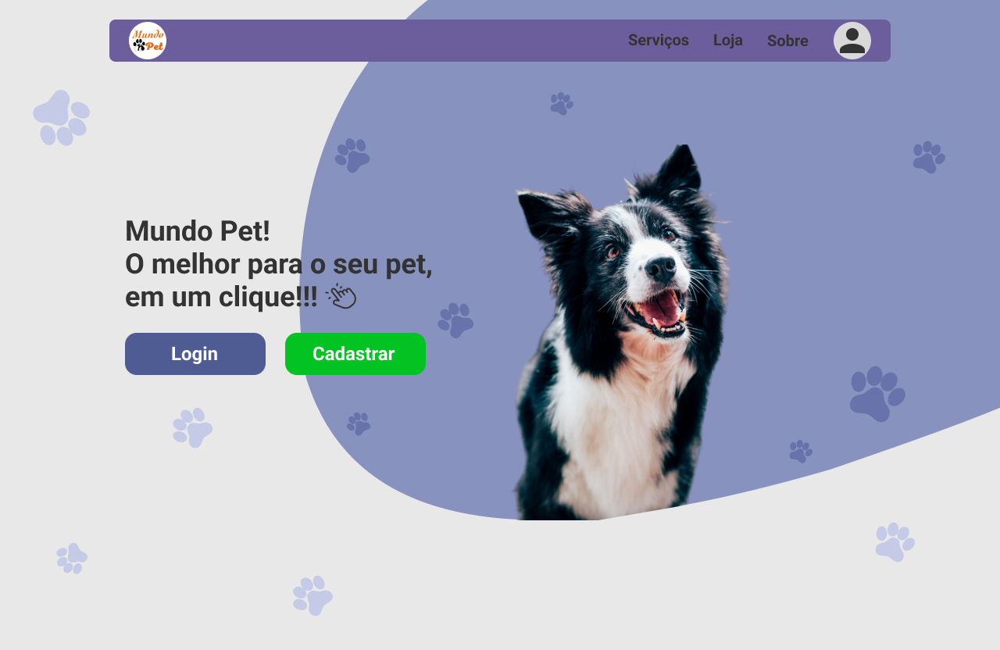

# Engenharia de Software 2024.2 - Universidade Federal do Tocantins
 Bacharelado em Ciência da Computação, 4º semestre
 Professor: Edeilson Milhomem da Silva
 Grupo: Lauro, Vicente, Henrique, José Borges, André Victor

## Mundo Pet
### Descrição 
Protótipo de Tela:

O Mundo Pet consiste em uma plataforma online para petshops, com funcionalidades de registro e acesso para clientes e administradores. O sistema oferece um catálogo abrangente de produtos e serviços, permitindo que os clientes agendem serviços e adicionem itens ao carrinho de compras. A plataforma também integra um sistema de pagamento online, garantindo uma experiência de compra prática e segura.

### Requisitos Funcionais do Projeto

1.  RF01 - Cadastro do Usuário
2.  RF02 - Login do Usuário e Admin
3.  RF03 - Catálogo de Serviços/Produtos
4.  RF04 - Agendamento de Serviços
5.  RF05 - Carrinho de Compras
6.  RF06 - Pagamento Online

### User Stories

**RF01 - Cadastro do Usuário** 
1. Como um cliente, quero poder criar uma conta no sistema para acessar os produtos e serviços oferecidos pelo petshop, registrando minhas informações pessoais, como nome, e-mail, telefone e endereço, para agilizar futuras compras e agendamentos. Para isso, na tela de login devo clicar em "Cadastre-se" logo abaixo do botão "Login". Ao clicar irá abrir o formulário de cadastro, no qual devo preencher todos os dados para concluir o cadastro.
 
 Protótipo de Tela:
 
 ![Tela de Cadastro]

 **RF02 - Login do Usuário e Administrador**
 1. Como um cliente cadastrado, quero poder acessar a plataforma utilizando meu e-mail e senha, para gerenciar minha conta e utilizar os serviços do petshop. Para isso, devo preencher os campos e-mail e senha com os dados cadastrados.
 2. Como um cliente cadastrado, desejo recuperar minha senha caso a esqueça, para garantir que possa acessar minha conta novamente. Para isso, devo clicar em "Esqueci minha senha" logo abaixo de "Cadastre-se", que abrirá uma página para recuperação de senha.
 3. Como um administrador, quero entrar no sistema usando minhas credenciais administrativas, para gerenciar o catálogo de produtos, serviços e usuários. Para isso, devo clicar em "Administrador" abaixo de "Esqueci minha senha" que irá alterar o login de usuário para administrador.
 
 Protótipo de Tela: 
 
 ![Tela de Login]

**RF03 - Catálogo de Serviços/Produtos**
1. Como um cliente logado, quero poder visualizar o catálogo completo de produtos e serviços oferecidos pelo petshop, para que eu possa escolher o que desejo comprar ou agendar. Para isso, na tela principal, devo ter acesso a uma lista organizada com descrições, preços, e imagens dos produtos e serviços. 

2. Como um administrador, quero poder adicionar, editar ou remover produtos e serviços do catálogo, para que eu possa manter as informações atualizadas. Para isso, devo acessar a área de administração e utilizar as funcionalidades de gerenciamento do catálogo.

**RF04 - Agendamento de Serviços**
1. Como um cliente Logado, quero poder agendar serviços do petshop que estão listados no catálogo, para isso, devo selecionar o serviço desejado, escolher uma data e horário disponíveis, e confirmar o agendamento

2. Como um administrador, quero gerenciar os agendamentos de serviços, para organizar a agenda do petshop. Para isso, devo acessar a área de adm e visualizar, editar ou cancelar agendamentos conforme necessário.

**RF05 - Carrinho de Compras**
1. Como um cliente logado, quero poder adicionar produtos ao carrinho de compras, para que eu possa revisar minhas escolhas antes de finalizar a compra. Para isso, devo clicar em "Adicionar ao carrinho" nos itens selecionados e acessar o carrinho para ver o resumo da minha compra. 

2. Como um cliente logado, quero poder remover itens do meu carrinho de compras, para que eu possa ajustar minha seleção antes de efetuar o pagamento. Para isso, devo acessar o carrinho, identificar o item que desejo remover e clicar em "Remover". 

3. Como um cliente logado, quero poder visualizar o total da minha compra, incluindo produtos e possíveis taxas, para que eu saiba o valor total antes de prosseguir para o pagamento. Para isso, ao acessar o carrinho, devo ver o valor total automaticamente calculado. 

**RF06 - Pagamento Online**
1. Como um cliente logado, quero poder finalizar a compra dos produtos no meu carrinho de forma segura, utilizando diferentes métodos de pagamento online, como cartão de crédito, débito ou outras opções disponíveis, para que eu possa concluir a transação com facilidade. Para isso, após revisar o carrinho, devo clicar em "Finalizar compra" e ser redirecionado para a página de pagamento. 

2. Como um administrador, quero poder visualizar um relatório de todas as transações realizadas na plataforma, para que eu possa monitorar as vendas. Para isso, devo acessar a área de administração e ter a opção de gerar relatórios filtrados por data, método de pagamento, ou cliente. 

### Iteração 1 - Catálogo 
*Objetivo da Sprint:* Permitir o usuário acessar o catálogo de produtos e serviços do petshop

*Features:*
1. Página de Listagem: Exibir produtos e serviços com imagens e descrições, somente para usuários logados
2. Filtros de Busca: Implementar filtros por categoria, preço e popularidade
3. Detalhes do Produto/Serviço: Página com informações detalhadas, avaliações e disponibilidade
4. Pesquisa por Palavra-chave: Barra de pesquisa para encontrar produtos/serviços específicos
5. Permitir o admin adicionar, editar ou remover produtos e serviços do catálogo

### Iteração 2: Agendamento 

*Objetivo da Sprint:* Permitir o usuário agendar algum serviço do petshop

*Features:*
1. Criar modelos de dados para agendamentos
2. Desenvolver os endpoints da API para ler, atualizar e deletar agendamento
3. Implementar a tela de seleção de serviços para agendamento
4. Implementar a tela de seleção de datas e horários
5. Permitir o admin visualizar, editar ou cancelar agendamentos
